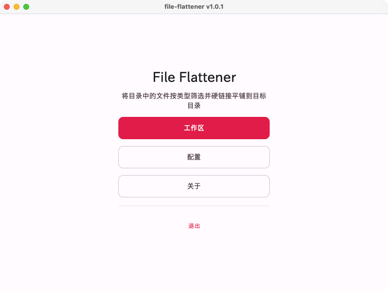
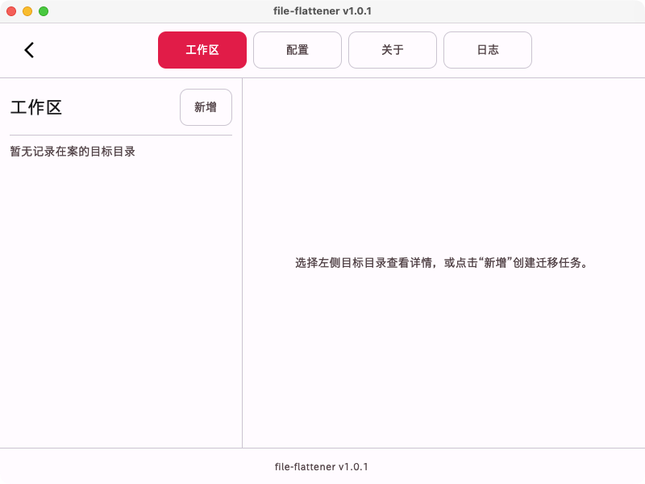
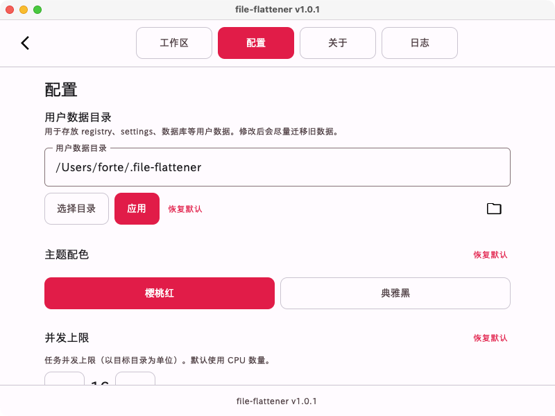
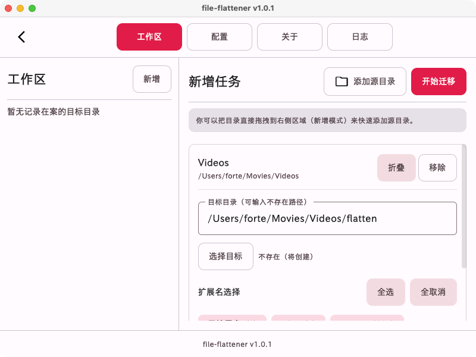
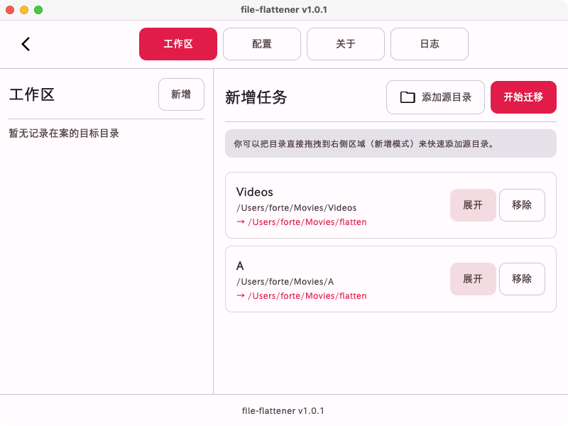
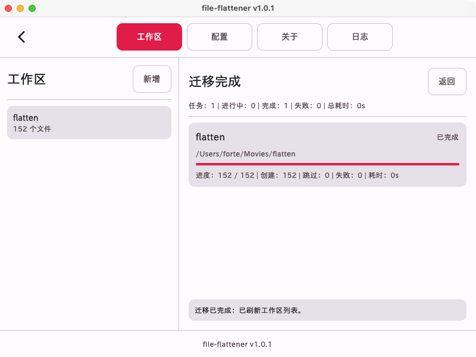
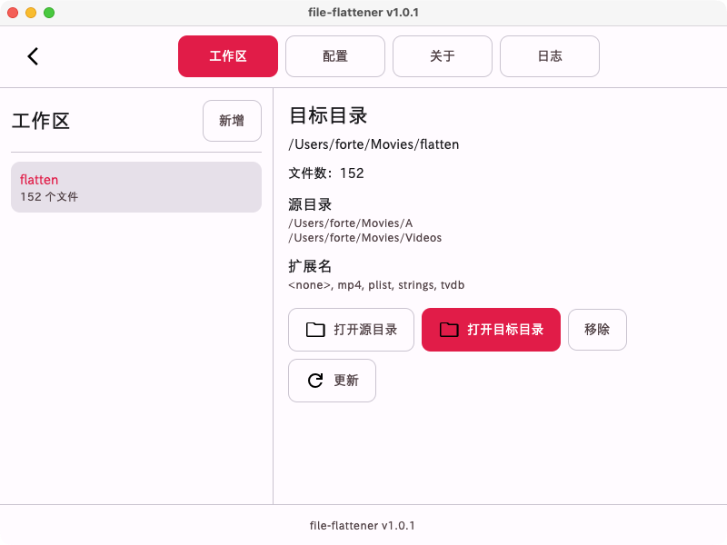

# 目录平铺助手


**中文** | [English](README.md)

一款桌面应用程序，通过文件链接将多个目录中的文件递归平铺到单一目标目录。

## 功能特性

- **目录递归平铺**：使用文件链接将源目录文件平铺到目标目录，**不占用额外磁盘空间**。
- **扩展名筛选**：按文件类型选择性转移。
- **多源目录**：支持同时添加多个源目录。
- **跨平台**：支持 Windows、macOS 和 Linux

## 使用场景

当你存在一些目录层级过多的文件、媒体等，而相对应的浏览应用无法直接递归地依次展现它们，
这时候你想要在不破坏原本资源的目录结构的前提下额外准备一个完全平铺、不占用额外磁盘空间、还方便马拉松式一马平川地阅览它们时，
**目录平铺助手** 就可以派上用场了！

## 安装

### 下载

访问 [下载页面](https://fortescarlet.github.io/file-flattener/download) 获取最新版本。

## 示例

### 平铺前

```
源目录：
├── 音乐/
│   ├── 专辑1/
│   │   ├── 曲目1.mp3
│   │   └── 曲目2.mp3
│   └── 专辑2/
│       └── 曲目3.mp3
└── 下载/
    └── 歌曲/
        └── 曲目4.mp3
```

### 平铺后

```
目标目录：
└── 平铺音乐/
    ├── 音乐-专辑1-曲目1.mp3 
    ├── 音乐-专辑1-曲目2.mp3 
    ├── 音乐-专辑2-曲目3.mp3 
    └── 下载-歌曲-曲目4.mp3 
```

所有文件集中在单一目录中，无需占用额外磁盘空间。

## 应用截图

<picture>
  <source media="(prefers-color-scheme: dark)" srcset=".github/images/Home_dark.png">
  <source media="(prefers-color-scheme: light)" srcset=".github/images/Home.png">
  
</picture>

<picture>
  <source media="(prefers-color-scheme: dark)" srcset=".github/images/Workspace_dark.png">
  <source media="(prefers-color-scheme: light)" srcset=".github/images/Workspace.png">
  
</picture>

<picture>
  <source media="(prefers-color-scheme: dark)" srcset=".github/images/Config_dark.png">
  <source media="(prefers-color-scheme: light)" srcset=".github/images/Config.png">
  
</picture>

<picture>
  <source media="(prefers-color-scheme: dark)" srcset=".github/images/Workspace-Add1_dark.png">
  <source media="(prefers-color-scheme: light)" srcset=".github/images/Workspace-Add1.png">
  
</picture>

<picture>
  <source media="(prefers-color-scheme: dark)" srcset=".github/images/Workspace-Add2_dark.png">
  <source media="(prefers-color-scheme: light)" srcset=".github/images/Workspace-Add2.png">
  
</picture>

<picture>
  <source media="(prefers-color-scheme: dark)" srcset=".github/images/Workspace-Work_dark.png">
  <source media="(prefers-color-scheme: light)" srcset=".github/images/Workspace-Work.png">
  
</picture>

<picture>
  <source media="(prefers-color-scheme: dark)" srcset=".github/images/Workspace-Detail_dark.png">
  <source media="(prefers-color-scheme: light)" srcset=".github/images/Workspace-Detail.png">
  
</picture>
